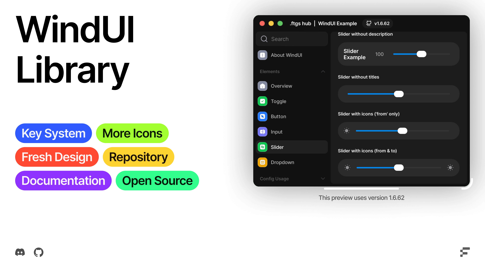

<!--<h1 align="center">VynxUI Modded</h1> -->

<!--
<picture>
    <source srcset="docs/banner-dark.webp" media="(prefers-color-scheme: dark)">
    <source srcset="docs/banner-light.webp" media="(prefers-color-scheme: light)">
    
</picture>-->


[](https://uibin.orqan.xyz/library/1678c7fc-92c0-40f8-a486-da13ae1635da)

> [!WARNING]
> VynxUI Modded is a fork of the original VynxUI project.

> [!WARNING]
> VynxUI Modded is currently in Beta.
> This project is still under active development. Bugs, issues, and unstable features may occur. We’re constantly working on improvements, so please be patient and report any problems you encounter.

## Credits

#### UI (https://github.com/cascadeui/Cascade)

- `Symbol`, `TitleStack`, `PullDownButton`, `PopUpButton`, `ImageSurface` elements and the `Sequoia` theme are ported/adapted from [Cascade](https://github.com/cascadeui/Cascade)

#### Icons (https://github.com/Footagesus/Icons)

- [Lucide-Icons](https://github.com/lucide-icons/lucide)
- [Craft Icons](https://www.figma.com/community/file/1415718327120418204)
- [Geist Icons](https://vercel.com/geist/icons)
- [Solar Icons](https://icones.js.org/collection/solar)
- [SF Symbols](https://sf-symbols-one.vercel.app/)

### Links

- [Discord Server](https://discord.gg/ftgs-development-hub-1300692552005189632)
- [Documentation](https://rxinoussouls.github.io/VynxUI/docs/vynxui/)
- [Installation](https://rxinoussouls.github.io/VynxUI/docs/vynxui/loadstring/)
- [Example](main_example.lua) (wip)
    ```luau
    loadstring(game:HttpGet('https://raw.githubusercontent.com/rxinoussouls/VynxUI/main/main_example.lua'))()
    ```
